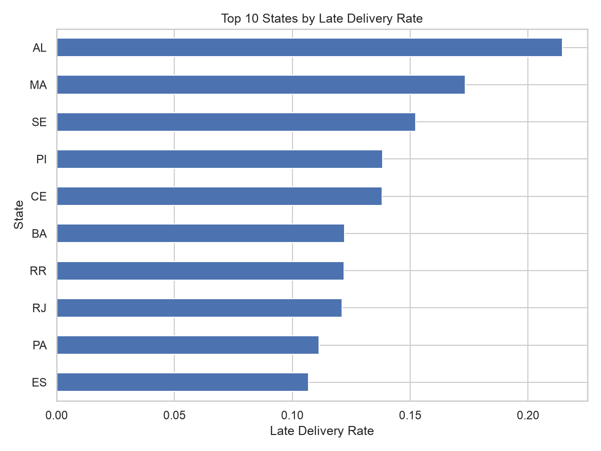
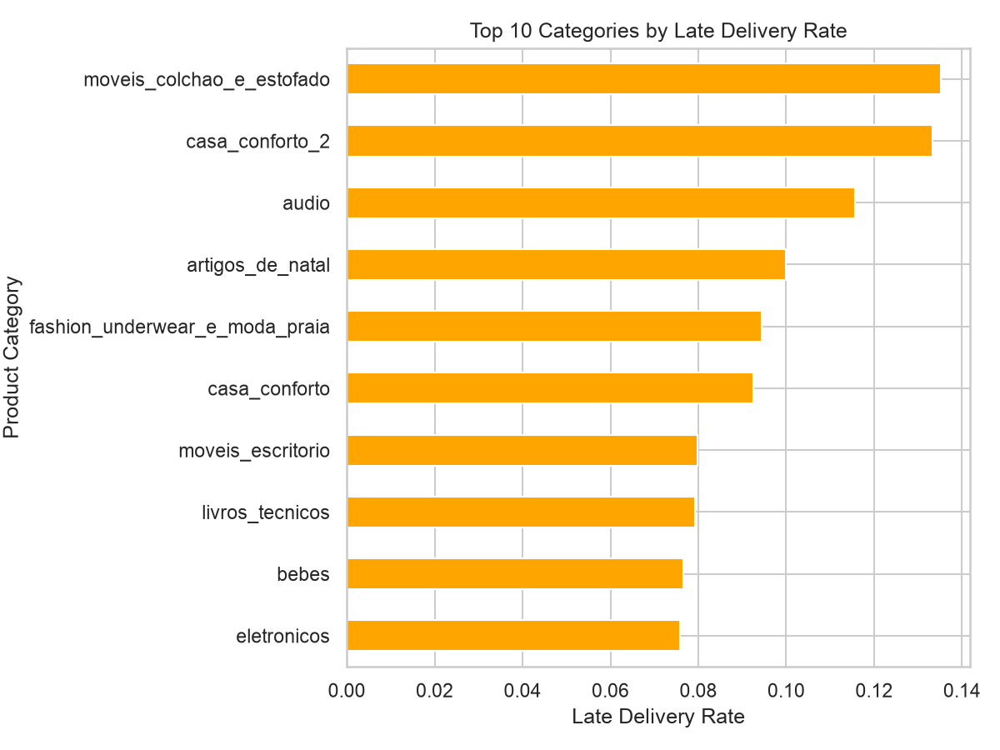
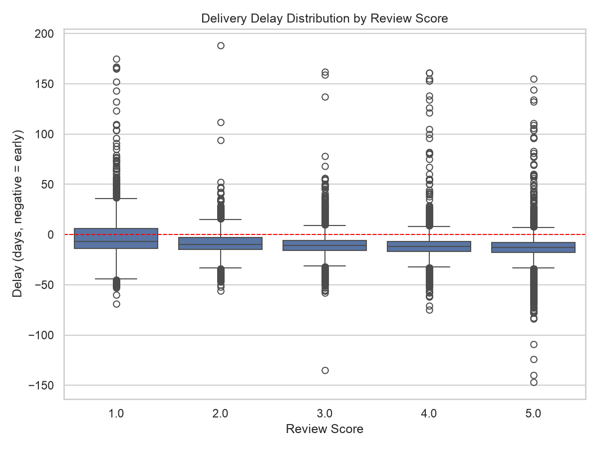

# Current-State Analysis: Delivery Delay & Customer Satisfaction

## 1. Summary

Approximately **6.8%** of delivered orders in the Olist dataset arrived after
the estimated delivery date. Late orders received an average review score of
**2.27**, compared to **4.29** for on-time orders — a difference of **2.02**
points. This suggests a measurable link between delivery delay and customer
satisfaction.

## 2. Methodology

- **Dataset:** Olist Brazilian E-Commerce Public Dataset (orders placed
  2016–2018)
- **Scope:** Orders with a non-null `order_delivered_customer_date`
  (2,965 orders excluded due to missing delivery date, ~3.0% of total)
- **Late delivery definition:**
  `order_delivered_customer_date > order_estimated_delivery_date`
- **Tools:** Python (pandas) for exploratory analysis; PostgreSQL for
  aggregate queries

## 3. Findings

### 3.1 Overall Late Delivery Rate

6.8% of delivered orders (~6,530 out of ~96,476 delivered orders) arrived later than the
estimated delivery date.

### 3.2 Late Delivery Rate by Region

The states with the highest late delivery rates were:

| State | Late Delivery Rate |
|---|---|
| AL | 21.4% |
| MA | 17.3% |
| SE | 15.2% |

### 3.3 Late Delivery Rate by Product Category

| Category | Late Delivery Rate |
|---|---|
| moveis_colchao_e_estofado (furniture/mattress) | 13.5% |
| casa_conforto_2 (home comfort) | 13.3% |
| audio | 11.6% |

### 3.4 Delivery Delay vs. Review Score

Orders delivered late had an average review score of **2.27**, compared to
**4.29** for on-time orders (correlation coefficient: **-0.27**). Approximately
**32.4%** of 1–2 star reviews were associated with a late delivery, compared
to **2.3%** among 4–5 star reviews.

## 4. Key Takeaways

- Late delivery is strongly associated with lower review scores (2.27 vs. 4.29 average, r = -0.27). Orders with a 1-2 star review were roughly 14x more likely to have been delivered late (32.4%) than orders with a 4-5 star review (2.3%). This indicates that delivery delay is one of the strongest identifiable drivers of poor customer satisfaction in this dataset.
- Late delivery rates vary sharply by region. From under 3% in states like AM and RO to over 20% in AL. This suggests that the root cause is likely tied to regional logistics/carrier performance rather than a platform-wide issue.
- Category-level late rates (up to ~13.5%) are notably lower than the worst regional rates. This suggests that geography is a stronger driver than product type. This points the proposed solution toward a region-aware alert system rather than a category-specific one.
- These findings support prioritizing an early-warning system for at-risk orders in high-risk regions, to be scoped in the BRD.